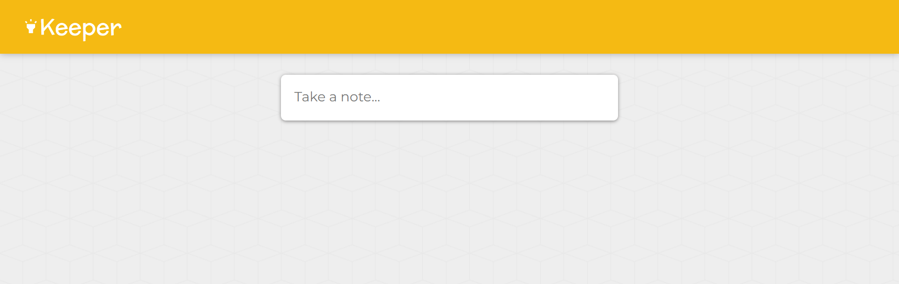
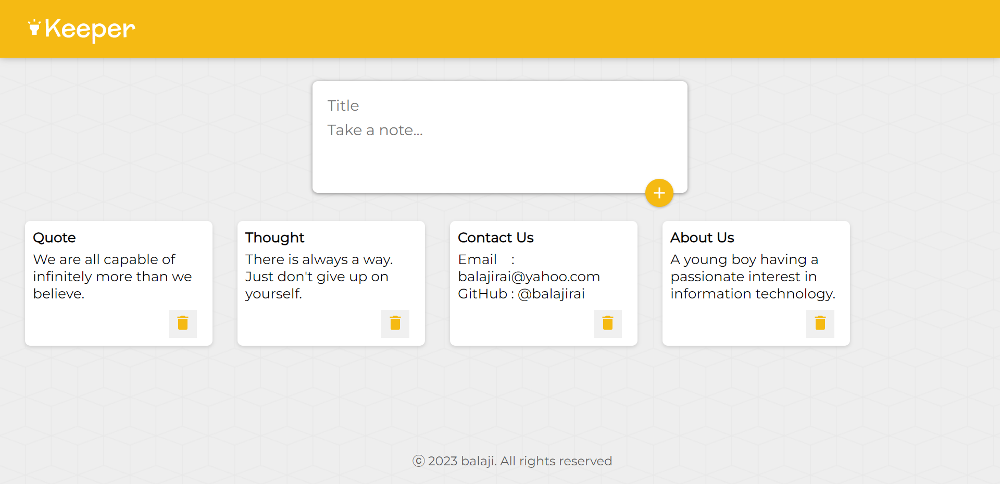

# Keeper App

This is a front-end web application akin to Google Keep which allow users to make notes. [Keeper App](https://reactnoteskeeper.netlify.app/)

---

---

## Technologies used:

- React js
- Material UI
- React Hooks
- ReactDOM

---

## Contributors

- Balaji

---

## License & Copyright

Copyright [©balaji](https://github.com/balajirai)

Licensed under the [MIT License](LICENSE)
